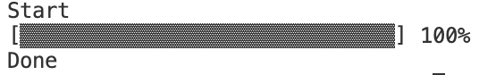
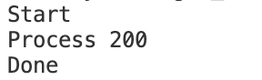

### Basic inline progressbar


# Install 

```go get github.com/DmitriyDev/golibs/progressbar```

# Usage


## Percent 


#### Init with param
```
...

multiplier := 4 //  Min - 1, Max - 4, Recommend - 3
lineLength := 140 //  Min - 1, Max - Inf, Recommend - 140


ip := prb.InlinePrint{}.New(multiplier, lineLength)
...

```

#### Init default
```
...
ip := prb.InlinePrint{}.NewDefault() // Default multiplier = 1, lineLength = 140
...

```


### Percent




```
package main

import (
	"fmt"
	prb "github.com/DmitriyDev/golibs/progressbar"
	"strings"
	"time"
)

func main() {

	fmt.Println("Start")
	ip := prb.InlinePrint{}.New(4, 100)

	for i := 0; i < 201; i++ {
		p := float64(i) / (float64(200) / float64(100))
		ip.PrintPercentLine(int(p))
		time.Sleep(time.Millisecond * 50)
	}

	fmt.Println("\nDone")
}
```

# Text



```

package main

import (
	"fmt"
	prb "github.com/DmitriyDev/golibs/progressbar"
	"strings"
	"time"
)

func main() {

	fmt.Println("Start")

	ip := prb.InlinePrint{}.NewDefault()

	for i := 0; i < 101; i++ {
		txt := fmt.Sprintf("Process %d", i)
		ip.PrintStringLine(txt)

		time.Sleep(time.Millisecond * 500)

	}

	fmt.Println("\nDone")
}


```